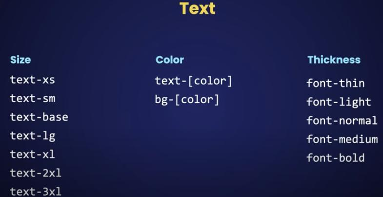
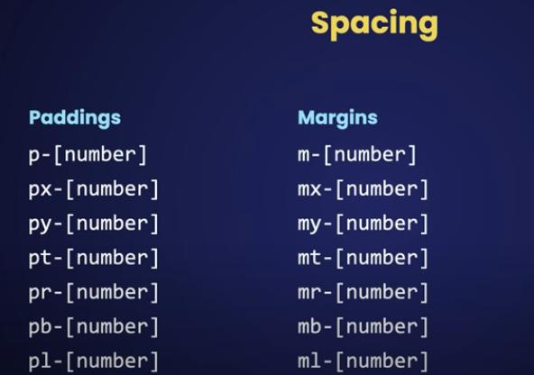

# Next.js Tutorial for Beginners | (App Router) with TypeScript

Welcome to this beginner-friendly Next.js tutorial! In this guide, we'll dive into Next.js 13, specifically focusing on the App Router and using TypeScript. By the end of this tutorial, you'll be well-equipped to build powerful full-stack applications with Next.js.

## Table of Contents

1. **Course Introduction**
    - What is Next.js?
    - Setting Up the Development Environment
    - Creating Your First Next.js Project
    - Understanding Project Structure
2. **Routing and Navigation**
3. **Client and Server Components**
4. **Data Fetching**
5. **Caching Strategies**
6. **Static and Dynamic Rendering**
7. **Styling Next.js Applications**
    - Global Styles
    - CSS Modules
    - Tailwind CSS
    - DaisyUI Integration

## Visual Studio Code Extensions

1. **ES7, JavaScript, and TypeScript Nightly**: This extension enables the nightly build of TypeScript (typescript@next) as VS Code's built-in TypeScript version used to power JavaScript and TypeScript IntelliSense. [Install here](https://marketplace.visualstudio.com/items?itemName=ms-vscode.vscode-typescript-next).

2. **Tailwind CSS IntelliSense**: Enhance your Tailwind development experience with autocomplete, syntax highlighting, and linting. Make sure you have Tailwind CSS installed and a `tailwind.config.{js,cjs,mjs,ts}` file in your workspace. [Install here](https://marketplace.visualstudio.com/items?itemName=bradlc.vscode-tailwindcss).

3. **Material Icon Theme**: Beautify your file icons with this Material Design-inspired icon theme. Install here.

4. **Next.js Snippets**: Speed up your Next.js development by using handy code snippets. Install here.

## Mock API for Testing

- Need some fake data for testing? Check out [JSONPlaceholder](https://jsonplaceholder.typicode.com/), a free online REST API that provides mock data. It's perfect for demos, READMEs, or local testing.

## Tailwind CSS Color Palette

- Tailwind CSS includes an expertly-crafted default color palette out-of-the-box. However, if you want to customize your colors, you can either configure your own custom colors from scratch or curate colors from the extensive included color palette. Explore the [Tailwind CSS color customization guide](https://tailwindcss.com/docs/customizing-colors) for more details.

Happy coding! 🚀

---

!Text Sizes, Colors, and Thickness

This image illustrates various text sizes, colors, and thickness options in Tailwind CSS.

 

---

!Tailwind CSS Spacing:

This image showcases the Spacing tools for Tailwind CSS .

 

---

[See this tuto ](https://www.youtube.com/watch?v=ZVnjOPwW4ZA&t=1963s)